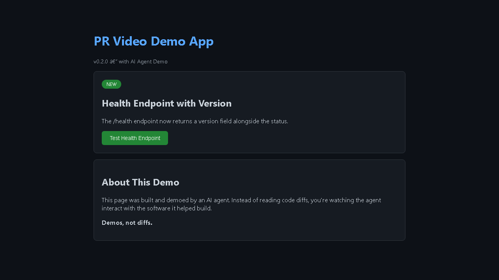
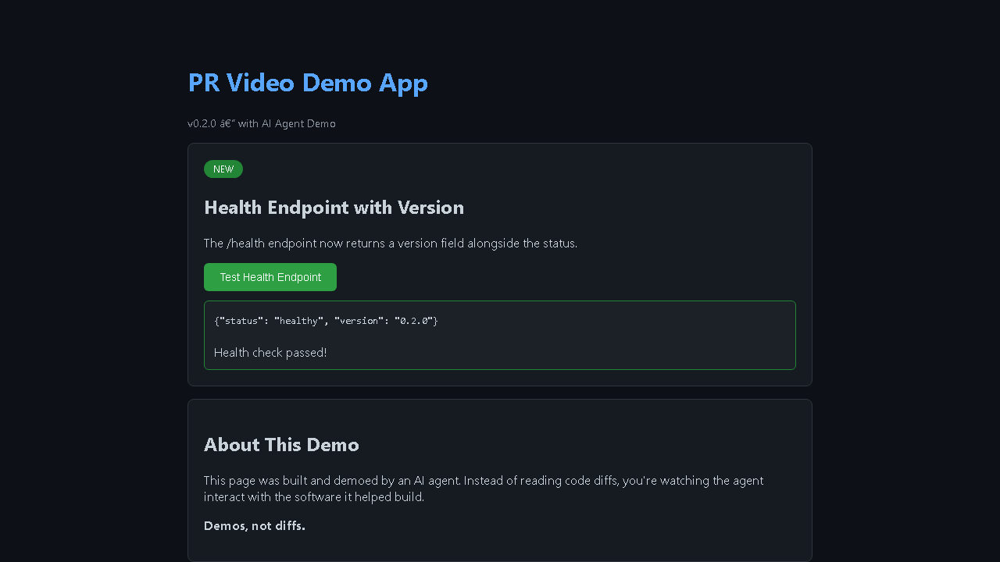
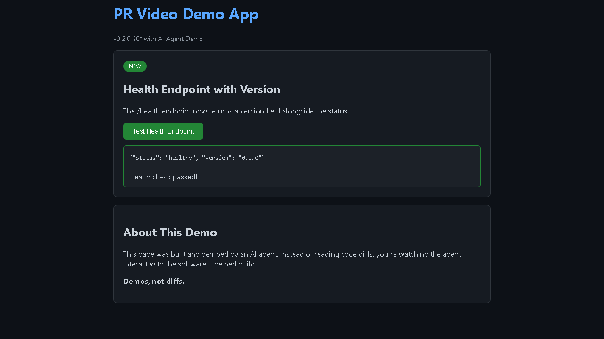

# PR Video Agent

> **Demos, not diffs.** An open-source clone of [Cursor's cloud agent video demo system](https://x.com/cursor_ai/status/2026369873321013568). AI agents analyze your PR diff, interact with your app like a real user, record a video demo, and post it to your PR.

<p align="center">
  
  
  
</p>

<p align="center"><em>Screenshots captured by the AI agent while demoing a health endpoint feature</em></p>

## What It Does

When a PR is opened, an AI agent:

1. **Reads the diff** to understand what changed
2. **Plans browser interactions** (navigate, click buttons, fill forms, scroll)
3. **Drives a real browser** via Playwright while recording the session
4. **Generates narration** from the diff using text-to-speech
5. **Assembles an MP4** combining the recording + narration audio
6. **Posts to the PR** with video, screenshots, and a summary

Instead of reading code diffs, reviewers watch a 30-second video of the agent proving the feature works.

## Architecture

Inspired by [Browser Use's sandbox architecture](https://docs.browser-use.com/) (Pattern 2: isolate the agent):

```
GitHub Actions / CLI
        |
        v
Control Plane (FastAPI)          <-- holds API keys, manages sessions
   |          ^
   | HTTP     | artifacts
   v          |
Agent Sandbox (Docker)           <-- zero secrets, disposable
   - Claude analyzes diff
   - Playwright drives browser
   - Xvfb + ffmpeg records desktop
   - Screenshots at key moments
   - Uploads artifacts to control plane
```

**Key principle:** The sandbox has nothing worth stealing and nothing worth preserving. It receives only 3 env vars (`SESSION_TOKEN`, `CONTROL_PLANE_URL`, `SESSION_ID`), which are deleted from `os.environ` after reading.

## Quick Start

### Local (Direct Mode -- no Docker needed)

```bash
# Install
cd backend && pip install -e ".[dev]"
playwright install chromium --with-deps

# Run the agent (needs ANTHROPIC_API_KEY for AI-planned interactions)
export ANTHROPIC_API_KEY=sk-ant-...
python __main__.py agent --url http://localhost:3000 --diff path/to/diff.txt

# Or run basic recording (no API key needed)
python __main__.py generate --url https://example.com --output demo.mp4
```

### Docker Sandbox Mode

```bash
# Build the sandbox image
docker build -f sandbox/Dockerfile -t pr-video-sandbox .

# Start the control plane
docker compose -f docker-compose.agent.yml up control-plane

# Run an agent in an isolated sandbox
docker compose -f docker-compose.agent.yml --profile agent run agent
```

### GitHub Actions (Automatic on PRs)

Add `ANTHROPIC_API_KEY` to your repo secrets. The included workflow (`.github/workflows/pr-video.yml`) triggers on every PR, runs the agent, and posts a comment with the demo video.

## API Endpoints

| Endpoint | Method | Purpose |
|----------|--------|---------|
| `/health` | GET | Health check |
| `/api/agents/run` | POST | Trigger an agent demo run |
| `/api/control/sessions` | POST | Create agent session (control plane) |
| `/api/control/sessions/{id}` | GET | Get session status |
| `/api/control/llm` | POST | Proxy LLM calls from sandbox |
| `/api/control/artifacts` | POST | Upload artifacts from sandbox |

## How the Agent Works

### 1. Planning Phase

The agent sends the git diff to Claude, which generates a structured interaction plan:

```json
{
  "description": "Demo the new health endpoint version field",
  "steps": [
    {"step_type": "navigate", "target": "http://localhost:3000"},
    {"step_type": "click", "selector": "#test-health"},
    {"step_type": "screenshot", "description": "Health response shown"},
    {"step_type": "assert_text", "selector": ".result", "value": "0.2.0"}
  ]
}
```

### 2. Execution Phase

Playwright executes each step with `record_video_dir` enabled, recording the entire browser session as WebM. Screenshots are captured at key moments.

### 3. Assembly Phase

FFmpeg combines the raw WebM recording with narration audio (generated by edge-tts from the diff summary) into a final MP4.

### 4. Artifact Collection

The video, screenshots, and logs are bundled and either:
- Saved locally (direct mode)
- Uploaded to the control plane (sandbox mode)
- Posted as a PR comment (GitHub Actions)

## Project Structure

```
backend/
  config/settings.py        # Environment config (only module that reads os.environ)
  models/
    agent.py                # AgentSession, InteractionPlan, InteractionStep
    artifact.py             # Artifact, ArtifactBundle
    video.py                # VideoRequest, VideoResult
  routers/
    health.py               # GET /health
    video.py                # POST /api/videos/generate
    agent.py                # POST /api/agents/run
    control.py              # Control plane endpoints (sessions, LLM proxy, artifacts)
  services/
    gateway.py              # Gateway protocol (DirectGateway / ControlPlaneGateway)
    agent_brain.py          # Claude-powered reasoning loop (plan -> execute -> video)
    interaction.py          # Playwright browser interactions
    screen_capture.py       # Xvfb + ffmpeg desktop recording
    artifact.py             # Artifact collector
    github_pr.py            # PR comment formatting and posting
    sandbox.py              # Docker container lifecycle
    control_plane.py        # Session management, token auth
    pipeline.py             # Basic video pipeline (recorder -> narrator -> assembler)
    recorder.py             # Playwright screen recording
    narrator.py             # Diff narration + edge-tts
    assembler.py            # FFmpeg assembly
  tests/                    # 56 tests covering all services
sandbox/
  Dockerfile                # Agent sandbox (Python + Chromium + Xvfb + ffmpeg)
  entrypoint.sh             # Start Xvfb, ffmpeg recording, run agent
  agent_runner.py           # Sandbox entry point
scripts/
  validate.sh               # 14 quality gates (lint, format, tests, types, E2E, etc.)
```

## Validation Gates

Every commit must pass `./scripts/validate.sh` (14 gates, 0 skipped for applicable checks):

| Gate | What it checks |
|------|---------------|
| B1 Lint | ruff catches syntax/style errors |
| B2 Format | Consistent formatting |
| B3 Pytest | 56 tests must pass |
| B4 Imports | Module dependency DAG enforced |
| B5 Golden Principles | No print(), no bare except, type hints required |
| B6 Architecture | No God files >300 lines |
| B7 Type Check | pyright catches real type errors |
| B8 Mutation Score | Test coverage ratio must be >60% |
| X1 Doc Refs | No broken documentation links |
| X2 Secrets | Scans for API keys in code |
| X3 E2E Local | Auto-boots server, runs 8 HTTP checks |
| X5 Feature List | 8/8 features must be passing |
| X6 Live Features | Tests features against running app |
| R1 Ratchet | Quality can only improve, never regress |

## Tech Stack

- **Python 3.12**, FastAPI, Uvicorn
- **Playwright** (browser automation + video recording)
- **FFmpeg** (video assembly)
- **edge-tts** (text-to-speech narration)
- **Claude API** (AI agent reasoning)
- **Docker** (sandbox isolation)
- **GitHub Actions** (CI/CD trigger)

## Comparison with Cursor

| Feature | Cursor Cloud Agents | PR Video Agent |
|---------|-------------------|----------------|
| Isolated sandbox | Firecracker VMs | Docker containers |
| Browser interaction | Computer use (pixels) | Playwright (DOM) |
| Video recording | Xvfb + ffmpeg | Playwright video + ffmpeg |
| Narration | No | Yes (edge-tts) |
| LLM proxy | Proprietary | Control plane (open) |
| PR integration | Built-in | GitHub Actions + gh CLI |
| Cost | $200/mo Ultra plan | Self-hosted (free) |
| Open source | No | Yes |

## License

MIT
